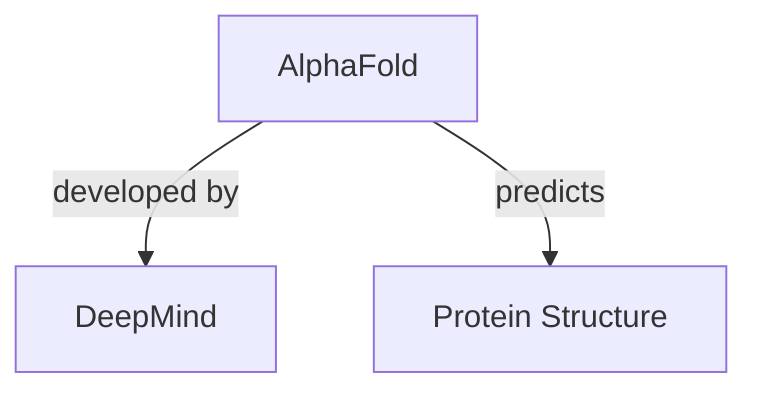

```markdown
---
name: pdf-asset-extractor
description: MCP tools for PDF ingestion → extract figures, tables, sections → build knowledge graph. Transforms PDF into queryable assets (images, tables, text) with cross-document RAG. Triggers: PDF, ingest, extract, 圖片, 表格, figure, table, manifest, knowledge graph, 知識圖譜, RAG, 文獻分析.
---

# PDF Asset Extractor (MCP Tools)

## 描述

將 PDF 文件分解為可查詢的資產（圖片、表格、章節），並建立跨文獻知識圖譜。

**核心能力**：
- 📄 **PDF 匯入** → 自動提取圖片、表格、文字
- 🖼️ **圖片提取** → 以 base64 返回，支援 Vision AI 分析
- 📊 **表格提取** → 轉換為 Markdown 格式
- 🔍 **知識圖譜** → 跨文獻關係查詢 (LightRAG)
- 📈 **圖譜視覺化** → 導出 Mermaid 圖表

## 觸發條件

- 「ingest PDF」、「匯入 PDF」、「解析文件」、「分析論文」
- 「看 manifest」、「文件結構」、「有什麼圖表」
- 「取得圖片」、「fetch figure」、「拿表格」、「extract」
- 「知識圖譜」、「cross-document」、「比較文獻」、「RAG」
- 「視覺化圖譜」、「export graph」、「mermaid」

---

## ⚠️ 重要警告

### 🖼️ 圖片 Context 限制

> **Base64 圖片非常大，一次只處理一張！**
>
> - 一張圖片 ≈ 200KB base64 ≈ **~270K tokens**
> - 對話 context 有限，多張圖片會快速耗盡
> - **建議流程**：先 `inspect_document_manifest` → 選定目標圖 → 一次 fetch 一張

### 👁️ 視覺能力提醒

> 如果 AI 有視覺能力（Vision），可直接分析返回的圖片
> 如果是純文字 AI，應誠實告知無法分析圖片內容

### 📸 圖片 ID 命名規則

> 系統以 `fig_{page}_{index}` 命名，非解析圖說文字
> 需手動對照 manifest 頁碼與實際 Figure 編號

---

## 🔧 可用 MCP Tools

### 文件處理

| Tool | 用途 | 參數 |
|------|------|------|
| `ingest_documents` | 匯入 PDF（ETL 流程） | `file_paths: list[str]`, `async_mode: bool` |
| `get_job_status` | 查詢 ETL 進度 | `job_id: str` |
| `list_jobs` | 列出所有工作 | `active_only: bool` |
| `cancel_job` | 取消 ETL 工作 | `job_id: str` |

### 資產查詢

| Tool | 用途 | 參數 |
|------|------|------|
| `list_documents` | 列出所有已處理文件 | 無 |
| `inspect_document_manifest` | 查看文件結構（圖/表/章節清單） | `doc_id: str` |
| `fetch_document_asset` | 取得特定資產 | `doc_id`, `asset_type`, `asset_id` |

### 知識圖譜

| Tool | 用途 | 參數 |
|------|------|------|
| `consult_knowledge_graph` | 跨文獻 RAG 查詢 | `query: str`, `mode: str` |
| `export_knowledge_graph` | 導出圖譜（JSON/Mermaid） | `format: str`, `limit: int` |

---

## 📂 MCP Resources（動態更新）

Resources 會自動更新，可直接瀏覽文件大綱：

| Resource URI | 說明 |
|--------------|------|
| `documents://list` | 所有已處理文件列表 |
| `document://{doc_id}/outline` | **📋 文件完整大綱**（推薦起點） |
| `document://{doc_id}/manifest` | 完整 manifest JSON |
| `document://{doc_id}/figures` | 圖片清單（ID、頁碼、尺寸） |
| `document://{doc_id}/tables` | 表格清單 |
| `document://{doc_id}/sections` | 章節層級結構 |
| `knowledge-graph://summary` | 知識圖譜統計概覽 |

### Resource 使用範例

```
# 瀏覽已處理的文件
→ documents://list

# 查看文件大綱（推薦起點）
→ document://abc123def/outline

# 列出所有圖片
→ document://abc123def/figures

# 知識圖譜概覽
→ knowledge-graph://summary
```

---

## 📋 標準操作流程

### 1️⃣ PDF 匯入（ETL）

```
使用者：「幫我匯入這份 PDF」/ 「分析這份論文」

步驟：
1. 取得 PDF 絕對路徑
2. 呼叫 ingest_documents（預設 async_mode=True）
3. 使用 get_job_status 追蹤進度
4. 完成後提供 doc_id
```

**範例呼叫**：
```python
# 異步匯入（推薦，大檔案用）
ingest_documents(file_paths=["/papers/study.pdf"])
# 返回 job_id，用 get_job_status 追蹤

# 同步匯入（小檔案）
ingest_documents(file_paths=["/papers/small.pdf"], async_mode=False)
```

### 2️⃣ 查看文件結構

```
使用者：「這份文件有什麼圖表？」

步驟：
1. 呼叫 list_documents 找到 doc_id
2. 呼叫 inspect_document_manifest
3. 列出所有 figures/tables/sections
```

**範例呼叫**：
```python
list_documents()
inspect_document_manifest(doc_id="abc123def")
```

**Manifest 內容**：
- 📊 Tables: `tab_1`, `tab_2`...（ID、頁碼）
- 🖼️ Figures: `fig_2_1`, `fig_3_1`...（ID、尺寸、頁碼）
- 📑 Sections: `sec_intro`, `sec_methods`...（標題、行號）

### 3️⃣ 取得特定資產

#### 取得圖片（⚠️ 一次一張）

```python
fetch_document_asset(
    doc_id="abc123def",
    asset_type="figure",
    asset_id="fig_3_1"
)
# 返回 ImageContent (base64) + metadata
```

#### 取得表格

```python
fetch_document_asset(
    doc_id="abc123def",
    asset_type="table",
    asset_id="tab_1"
)
# 返回 Markdown 格式表格
```

#### 取得章節/全文

```python
# 特定章節
fetch_document_asset(doc_id="abc123def", asset_type="section", asset_id="sec_methods")

# 全文 Markdown
fetch_document_asset(doc_id="abc123def", asset_type="full_text", asset_id="full")
```

### 4️⃣ 知識圖譜查詢

```
使用者：「比較這兩篇文獻的發現」/ 「AlphaFold 是什麼？」

步驟：
1. 確認文件已 ingest 且已建立索引
2. 選擇查詢模式
3. 呼叫 consult_knowledge_graph
```

**查詢模式**：

| Mode | 用途 | 適合場景 |
|------|------|----------|
| `local` | 細節查詢 | 特定藥物劑量、具體數據 |
| `global` | 全局模式 | 跨文獻趨勢、主題歸納 |
| `hybrid` | 混合模式（推薦） | 一般問答 |

**範例呼叫**：
```python
consult_knowledge_graph(
    query="What is AlphaFold and how does it work?",
    mode="hybrid"
)
```

### 5️⃣ 知識圖譜視覺化 ✨ NEW

```
使用者：「顯示知識圖譜」/ 「圖譜長什麼樣？」

步驟：
1. 選擇輸出格式
2. 呼叫 export_knowledge_graph
3. Mermaid 格式可直接渲染
```

**輸出格式**：

| Format | 用途 | 建議 limit |
|--------|------|-----------|
| `summary` | 統計 + 樣本節點 | 50（預設）|
| `mermaid` | Mermaid 流程圖 | 20-30 |
| `json` | 完整節點/邊 JSON | 100+ |

**範例呼叫**：
```python
# 快速概覽
export_knowledge_graph(format="summary")

# Mermaid 視覺化（可渲染）
export_knowledge_graph(format="mermaid", limit=25)

# 完整 JSON 數據
export_knowledge_graph(format="json", limit=100)
```

**Mermaid 輸出範例**：


---

## 🎯 情境範例

### 情境 A：分析新 PDF 論文

```
使用者：「幫我分析這份 PDF」

執行流程：
1. ingest_documents → 取得 job_id
2. get_job_status → 等待完成
3. inspect_document_manifest → 了解結構
4. fetch section (Introduction) → 快速瀏覽
5. 根據需要 fetch 特定圖表
6. consult_knowledge_graph → 整合分析
```

### 情境 B：提取圖表

```
使用者：「給我 Figure 3」

執行流程：
1. list_documents → 找到 doc_id
2. inspect_document_manifest → 找 fig_X_X 對應
3. fetch_document_asset(asset_type="figure", asset_id="fig_3_1")
4. 返回圖片 + metadata
```

### 情境 C：跨文獻比較

```
使用者：「比較 A 和 B 論文的結論」

執行流程：
1. 確認兩份文件都已 ingest
2. consult_knowledge_graph(mode="global")
3. export_knowledge_graph(format="mermaid") → 視覺化關係
```

### 情境 D：探索知識圖譜

```
使用者：「圖譜裡有什麼？」

執行流程：
1. export_knowledge_graph(format="summary") → 統計
2. export_knowledge_graph(format="mermaid", limit=20) → 視覺化
```

---

## ⚡ Context 預算

| 資產類型 | 大約 Token 數 | 建議 |
|----------|--------------|------|
| Section (1頁) | ~500-1000 | ✅ 優先使用 |
| Table | ~200-500 | ✅ 低成本 |
| Figure (base64) | ~200K-500K | ⚠️ 一次一張 |
| Full text (10頁) | ~10K-20K | ⚠️ 視需要 |
| Knowledge Graph (summary) | ~500 | ✅ 快速概覽 |
| Knowledge Graph (mermaid) | ~1K-3K | ✅ 視覺化 |

---

## 📊 輸出格式

操作後應回報：

```markdown
## PDF 處理結果

### 📄 文件資訊
- **doc_id**: `abc123def`
- **標題**: Nobel Prize Chemistry 2024
- **頁數**: 15 頁

### 📊 可用資產
| 類型 | 數量 | 範例 ID |
|------|------|---------|
| Figures | 8 | fig_2_1, fig_5_1 |
| Tables | 3 | tab_1, tab_2 |
| Sections | 5 | sec_intro, sec_methods |

### 🔗 知識圖譜
- **節點**: 383
- **關係**: 99
- 可使用 `export_knowledge_graph` 視覺化
```
```
