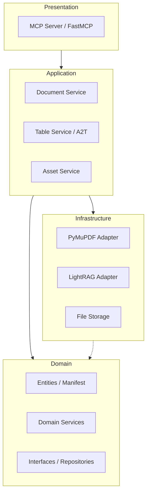

# Architecture

本專案採用 **Domain-Driven Design (DDD)** 架構，並透過 **Model Context Protocol (MCP)** 暴露功能給 AI Agent。

## 系統架構圖

## 分層說明

### 1. Presentation Layer (表現層)
- **位置**: `src/presentation/`
- **職責**: 實作 MCP 協議，定義 Tools (工具) 與 Resources (資源)。
- **技術**: FastMCP。

### 2. Application Layer (應用層)
- **位置**: `src/application/`
- **職責**: 協調領域對象執行業務流程（如 Ingestion 流程、A2T 表格工作流）。
- **組件**: `DocumentService`, `TableService` (A2T 核心), `AssetService`。

### 3. Domain Layer (領域層)
- **位置**: `src/domain/`
- **職責**: 核心業務邏輯、實體定義與介面規範。
- **組件**: `DocumentManifest`, `TableDraft`, `TableSchema`, `PDFExtractorInterface`。

### 4. Infrastructure Layer (基礎設施層)
- **位置**: `src/infrastructure/`
- **職責**: 外部技術實作，如 PDF 解析、向量資料庫、Excel 渲染。
- **技術**: **PyMuPDF** (PDF 解析), **LightRAG** (知識圖譜), **XlsxWriter** (Excel 渲染)。

## ETL 流程 (Asset-Aware)

1. **Ingestion**: 接收 PDF 路徑，啟動非同步 Job。
2. **Decomposition**: 使用 PyMuPDF 將 PDF 分解為 Markdown、表格與圖片。
3. **Manifest Generation**: 建立 `manifest.json` 作為文件的「地圖」。
4. **Indexing**: 將 Markdown 內容餵入 LightRAG 建立知識圖譜與向量索引。
5. **Storage**: 將所有資產存儲於本地 `./data/doc_{id}/` 目錄。

## A2T (Anything to Table) 工作流

為了優化 Token 使用並支援長表格，A2T 採用了 **Draft/Commit** 模式：

1. **Planning**: 使用 `plan_table_schema` 讓 AI 根據文獻內容發想表格結構。
2. **Drafting**: 建立 `TableDraft` 並持久化於磁碟，支援斷點續作。
3. **Batching**: 透過 `add_rows_to_draft` 分批寫入資料，避免單次對話過長。
4. **Resumption**: `resume_draft` 僅回傳最後兩列作為上下文，極大節省 Token。
5. **Commitment**: 確認無誤後 `commit_draft_to_table` 正式存檔並可渲染為 Excel。

## VS Code 整合

- **vscode-extension**: 提供圖形化介面管理 MCP Server 狀態、查看已處理文件列表，並自動配置環境變數。
