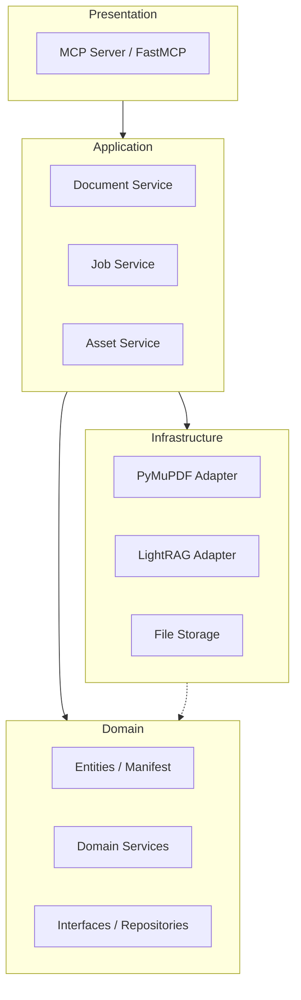

# Architecture

本專案採用 **Domain-Driven Design (DDD)** 架構，並透過 **Model Context Protocol (MCP)** 暴露功能給 AI Agent。

## 系統架構圖

## 分層說明

### 1. Presentation Layer (表現層)
- **位置**: `src/presentation/`
- **職責**: 實作 MCP 協議，定義 Tools (工具) 與 Resources (資源)。
- **技術**: FastMCP。

### 2. Application Layer (應用層)
- **位置**: `src/application/`
- **職責**: 協調領域對象執行業務流程（如 Ingestion 流程、Job 狀態追蹤）。
- **組件**: `DocumentService`, `JobService`, `AssetService`。

### 3. Domain Layer (領域層)
- **位置**: `src/domain/`
- **職責**: 核心業務邏輯、實體定義與介面規範。
- **組件**: `DocumentManifest`, `IngestResult`, `PDFExtractorInterface`。

### 4. Infrastructure Layer (基礎設施層)
- **位置**: `src/infrastructure/`
- **職責**: 外部技術實作，如 PDF 解析、向量資料庫、檔案系統。
- **技術**: **PyMuPDF** (PDF 解析), **LightRAG** (知識圖譜)。

## ETL 流程 (Asset-Aware)

1. **Ingestion**: 接收 PDF 路徑，啟動非同步 Job。
2. **Decomposition**: 使用 PyMuPDF 將 PDF 分解為 Markdown、表格與圖片。
3. **Manifest Generation**: 建立 `manifest.json` 作為文件的「地圖」。
4. **Indexing**: 將 Markdown 內容餵入 LightRAG 建立知識圖譜與向量索引。
5. **Storage**: 將所有資產存儲於本地 `./data/doc_{id}/` 目錄。

## VS Code 整合

- **vscode-extension**: 提供圖形化介面管理 MCP Server 狀態、查看已處理文件列表，並自動配置環境變數。
