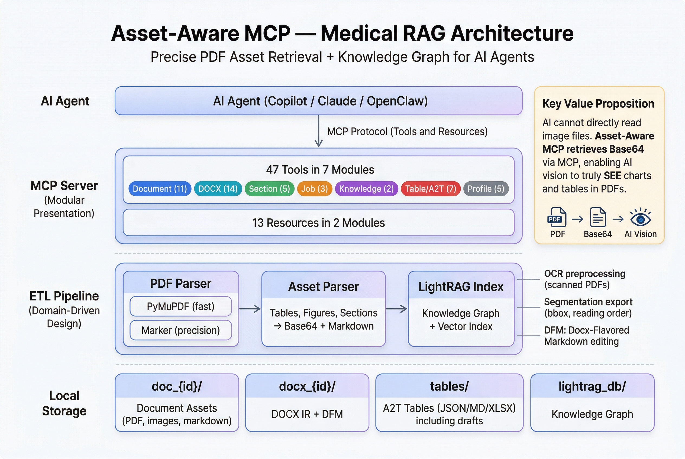

# asset-aware-mcp

> 🏥 Medical RAG with Asset-Aware MCP - Precise PDF asset retrieval (tables, figures, sections) and Knowledge Graph for AI Agents.

[](https://opensource.org/licenses/Apache-2.0)

🌐 [繁體中文](README.zh-TW.md) · [Docs Site](https://u9401066.github.io/asset-aware-mcp/#/overview-zh) · [GitHub Wiki](https://github.com/u9401066/asset-aware-mcp/wiki)

## 🎯 Why Asset-Aware MCP?

**AI cannot directly read image files on your computer.** This is a common misconception.

| Method | Can AI analyze image content? | Description |
|------|:-------------------:|------|
| ❌ Provide PNG path | No | AI cannot access the local file system |
| ✅ **Asset-Aware MCP** | **Yes** | Retrieves Base64 via MCP, allowing AI vision to understand directly |

### Real-world Effect

```
# After retrieving the image via MCP, the AI can analyze it directly:

User: What is this figure about?

AI: This is the architecture diagram for Scaled Dot-Product Attention:
    1. Inputs: Q (Query), K (Key), V (Value)
    2. MatMul of Q and K
    3. Scale (1/√dₖ)
    4. Optional Mask (for decoder)
    5. SoftMax normalization
    6. Final MatMul with V to get the output
```

**This is the value of Asset-Aware MCP** - enabling AI Agents to truly "see" and understand charts and tables in your PDF literature.

---

## ✨ Features

- 📄 **Asset-Aware ETL** - PDF → Markdown with a PyMuPDF-first parser and retained Marker code path:
  - **PyMuPDF** (default) - Fast extraction (~50MB)
  - **Marker** (`use_marker=True`) - High-precision structured parsing code path retained, but packaged runtime is on security hold in v0.6.27 until upstream `marker-pdf` supports patched Pillow
- 🧩 **Unified Segmentation Export** - Normalized `segmentation.json` merges manifest, blocks, reading order, and persisted markdown line spans for downstream tools and extensions.
- 🖼️ **Layout Overlay Debugging** - Render page overlays from `original.pdf` to inspect bbox, segment type, and reading order visually.
- 🔤 **On-Demand OCR Preprocessing** - Optional `ocrmypdf` preprocessing path for scanned PDFs before ETL.
- 🧭 **Section Navigation** - Dynamic hierarchy section tree with 5 tools: browse, search, detail, content reading, and block extraction for any depth of headings.
- 🔄 **Async Job Pipeline** - Supports asynchronous task processing and progress tracking for large documents.
- 🗺️ **Document Manifest** - Provides a structured "map" of the document for precise data access by Agents.
- 🧠 **LightRAG Integration** - Knowledge Graph + Vector Index, supporting cross-document comparison and reasoning.
- 🧾 **Citation-Aware KG Output** - `consult_knowledge_graph` now supports structured answer/reference payloads for downstream agent workflows.
- 📝 **Docx Editing (DFM)** - Edit .docx files in Markdown via **Docx-Flavored Markdown** format. Supports legacy `.doc`, `.odt`, and `.ods` ingest via LibreOffice auto-conversion. 16 tools: ingest, read, save, list, delete, export, strict round-trip validation, DOCX→PDF, DOCX→DOC, DOCX→ODT, and Docx ↔ A2T bridges.
- 🛡️ **DFM Integrity Checker** - Automatic validation and auto-repair at every pipeline stage (post-ingest, pre-save, post-save). Catches orphan markers, column mismatches, and format inconsistencies.
- 📊 **A2T (Anything to Table)** - 7 operation-based tools for building professional tables from **any source** (PDF assets, Knowledge Graph, URLs, user input). Features: **Citations** (AssetRef), **Audit Trail**, **Schema Evolution**, **Templates**, **Drafting**, and **Token-efficient resumption**.
- 🖥️ **VS Code Management Extension** - Graphical interface for monitoring server status, ingested documents, and **A2T tables/drafts** with one-click Excel export.
- 🔌 **MCP Server** - Exposes tools and resources to Copilot/Claude via FastMCP.
- 🏥 **Medical Research Focus** - Optimized for medical literature, supporting Base64 image transmission for Vision AI analysis.

## 🏗️ Architecture

<p align="center">
  
</p>

```
┌─────────────────────────────────────────────────────────┐
│                    AI Agent (Copilot)                   │
└─────────────────────┬───────────────────────────────────┘
                      │ MCP Protocol (Tools & Resources)
┌─────────────────────▼───────────────────────────────────┐
│            MCP Server (Modular Presentation)            │
│  ┌─────────────────────────────────────────────────┐   │
│  │ tools/: 59 tools in 7 modules                   │   │
│  │   document (18) │ docx (16) │ section (5)       │   │
│  │   job (4) │ knowledge (3) │ table (7) │ profile (6) │
│  └─────────────────────────────────────────────────┘   │
│  ┌─────────────────────────────────────────────────┐   │
│  │ resources/: 13 resources in 2 modules           │   │
│  └─────────────────────────────────────────────────┘   │
└─────────────────────┬───────────────────────────────────┘
                      │
┌─────────────────────▼───────────────────────────────────┐
│                  ETL Pipeline (DDD)                     │
│  ┌──────────┐  ┌──────────┐  ┌──────────┐              │
│  │ PyMuPDF  │  │  Asset   │  │ LightRAG │              │
│  │ Adapter  │→ │  Parser  │→ │  Index   │              │
│  └──────────┘  └──────────┘  └──────────┘              │
└─────────────────────┬───────────────────────────────────┘
                      │
┌─────────────────────▼───────────────────────────────────┐
│                   Local Storage                         │
│  ./data/                                                │
│  ├── {doc_id}/        # PDF document artifacts          │
│  ├── docx_{id}/       # Docx IR + DFM + Assets          │
│  ├── tables/          # A2T Tables (JSON/MD/XLSX)       │
│  │   └── drafts/      # Table Drafts (Persistence)      │
│  └── lightrag_db/     # Knowledge Graph                 │
└─────────────────────────────────────────────────────────┘
```

## 📁 Project Structure (DDD)

```
asset-aware-mcp/
├── src/
│   ├── domain/              # 🔵 Domain: Entities, Value Objects, Interfaces
│   ├── application/         # 🟢 Application: Doc Service, Table Service (A2T), Asset Service
│   ├── infrastructure/      # 🟠 Infrastructure: PyMuPDF, LightRAG, Excel Renderer
│   └── presentation/        # 🔴 Presentation: MCP Server (FastMCP)
├── data/                    # Document and Asset Storage
├── docs/
│   └── spec.md              # Technical Specification
├── tests/                   # Unit and Integration Tests
├── vscode-extension/        # VS Code Management Extension
└── pyproject.toml           # uv Project Config
```

## 📐 Architecture Diagrams

Visual overview for the project. All diagrams use consistent GitHub README style.

| Diagram | Description |
|---------|-------------|
| [01 — System Architecture](docs/diagrams/01-system-architecture.jpg) | Full stack: Telegram → Gateway → MCP Adapter → 3 MCP servers → Ollama |
| [02 — Data Layout](docs/diagrams/02-data-layout.jpg) | 59 tools organized in 7 categories with asset-aware data tree |
| [03 — PDF Ingestion Pipeline](docs/diagrams/03-pdf-ingestion-pipeline.jpg) | 7-stage flow from PDF upload to knowledge graph |
| [04 — DOCX Bidirectional Edit](docs/diagrams/04-docx-edit-pipeline.jpg) | DOCX ingest → TableContext edit → round-trip save workflow |
| [05 — Knowledge Graph Search](docs/diagrams/05-knowledge-graph-search.jpg) | Cross-document search with 3 parallel query paths |
| [06 — Installation Steps](docs/diagrams/06-installation-steps.jpg) | 7-step installation from clone to verification |
| [07 — PDF ETL Pipeline](docs/diagrams/07-pdf-etl-pipeline.jpg) | PyMuPDF default path + Marker security-hold diagnostics |
| [08 — KG Architecture](docs/diagrams/08-knowledge-graph-architecture.jpg) | lightrag-hku 3-layer KG architecture |
| [09 — Agent Harness Concept](docs/diagrams/09-agent-harness-concept.jpg) | Assistant harness model for stateless agents |

> 💡 All generation prompts are saved in [docs/diagrams/ALL-PROMPTS.md](docs/diagrams/ALL-PROMPTS.md) for style consistency and regeneration.

## 🚀 Quick Start

```bash
# Install dependencies (using uv) — default install skips Marker/torch
uv sync

# v0.6.27: Marker extra is temporarily empty because marker-pdf pins
# Pillow<11 while the secure runtime requires Pillow>=12.2.0.
# Use the default PyMuPDF backend until upstream marker-pdf supports patched Pillow.

# Run MCP Server
uv run python -m src.presentation.server

# Or use the VS Code extension for graphical management
```

Runtime note:
The VS Code extension prefers a managed Python 3.11 runtime when launching the MCP server via `uv` or `uvx`. This avoids native package builds on end-user machines, especially macOS systems without Xcode Command Line Tools, while keeping the project itself compatible with newer Python versions.

Installation scope note:
- The VS Code extension installs once per user (global). MCP launch env defaults `DATA_DIR` to workspace `./data` and `UV_CACHE_DIR` to `DATA_DIR/.uv-cache`; Prepare Server Runtime warms a workspace `.uv-cache`, falling back to extension global storage only when no workspace is open.
- Runtime data stays with your repo: `.env` and `assetAwareMcp.dataDir` default to `./data`, so ingested assets and the uv cache used by the launched server remain scoped to the current workspace.

Marker note:
In v0.6.27 the packaged Marker extra is intentionally on security hold: upstream `marker-pdf` 1.10.2 requires `Pillow<11`, while this release pins `Pillow>=12.2.0` for patched image-processing security. Default installs use the PyMuPDF backend only. `use_marker=True` / `parse_pdf_structure` will report that Marker is unavailable until upstream Marker supports a patched Pillow range.

## 🔌 MCP Tools

### Document & Asset Tools

| Tool | Purpose |
|------|---------|
| `ingest_documents` | Process PDF files with PyMuPDF; `use_marker=True` currently falls back or fails closed while Marker is on security hold |
| `list_documents` | List all ingested documents and their asset counts |
| `delete_document` | Delete an ingested PDF, its local artifacts, and LightRAG index entries when enabled |
| `convert_pdf_to_docx` | Reconstruct a readable DOCX from extracted PDF content |
| `convert_pdf_to_pptx` | Rebuild editable PPTX slides from extracted PDF markdown and figures |
| `inspect_document_manifest` | Inspect document structure before fetching specific assets |
| `fetch_document_asset` | Precisely retrieve tables (MD) / figures (B64) / sections |
| `parse_pdf_structure` | Queue structured parsing work; Marker output is unavailable in v0.6.27 until upstream Marker supports patched Pillow |
| `search_source_location` | Search exact source locations with page + bbox for verification |
| `export_document_segmentation` | Export normalized `segmentation.json` with reading order + line ranges |
| `visualize_document_layout` | Render page overlay images for bbox / type / reading-order inspection |
| `ocr_pdf_document` | Run OCR preprocessing and generate a cleaned PDF for later ETL |
| `find_evidence_spans` | Search citation-ready spans with source revision, locator, hash, and CRAAP scaffold |
| `verify_citation_ref` | Verify span AssetRefs against the current citation index and locator metadata |
| `document` | Operation-based facade over PDF ingest/list/delete/inspect/parse |
| `document_asset` | Operation-based facade over asset fetch and section tree/detail/blocks/search |
| `evidence` | Operation-based facade over citation span find/verify/source-location search |
| `convert_document` | Operation-based facade for PDF, DOCX/DFM, and Markdown conversions |

### Job Management Tools

| Tool | Purpose |
|------|---------|
| `get_job_status` | Get async ingestion job progress and final result |
| `list_jobs` | List active or historical ETL jobs |
| `cancel_job` | Cancel a running ETL job |
| `job` | Operation-based facade over job get/list/cancel |

### Knowledge Graph Tools

| Tool | Purpose |
|------|---------|
| `consult_knowledge_graph` | Citation-aware knowledge graph query with `structured`, `data`, and `text` response modes |
| `export_knowledge_graph` | Export graph summary / JSON / Mermaid for inspection |
| `knowledge` | Operation-based facade over knowledge graph consult/export |

Knowledge graph note:
- `consult_knowledge_graph` defaults to `response_mode="structured"` and can return `answer`, `references`, `metadata`, `retrieval`, and `counts` for agent-side citation workflows.
- Use `response_mode="data"` when you want retrieval payloads without final answer synthesis, or `response_mode="text"` for legacy plain-text behavior.

### Section Navigation Tools (Dynamic Hierarchy)

| Tool | Purpose |
|------|---------|
| `list_section_tree` | Display complete section hierarchy tree (supports any depth) |
| `get_section_detail` | Get detailed info for a specific section |
| `get_section_blocks` | Extract all blocks from a section with page + bbox |
| `search_sections` | Search section titles |
| `get_section_content` | Read section content via asset service |

### Docx Editing Tools (DFM — Docx-Flavored Markdown)

> Edit .docx files as Markdown. Preserves formatting, tables, media on round-trip.

| Tool | Purpose |
|------|---------|
| `ingest_docx` | Import .docx and decompose into DFM blocks |
| `get_docx_content` | Read DFM content of specific blocks |
| `save_docx` | Write DFM edits back to .docx |
| `list_docx_blocks` | List document block structure |
| `list_docx_documents` | List all ingested DOCX/DFM documents |
| `delete_docx` | Delete an ingested DOCX/DFM document and its local artifacts |
| `convert_docx_to_pdf` | Export the current DOCX/DFM state to PDF in fidelity mode |
| `convert_docx_to_doc` | Export the current DOCX/DFM state to DOC in fidelity mode |
| `docx_validate_roundtrip` | 6-dimension round-trip fidelity validation + file-level comparison (SHA-256, ZIP diff) |
| `docx_table_to_context` | Bridge: Docx table → A2T context |
| `docx_table_from_context` | Bridge: A2T table → Docx table |
| `docx_chart_data` | Extract chart data from Docx |
| `export_markdown` | Export Markdown to .docx/.pdf/.doc |
| `convert_docx_to_odt` | Export the current DOCX/DFM state to ODT |
| `docx` | Operation-based facade over DOCX/DFM ingest/get/save/list/delete/blocks/validate |
| `docx_table` | Operation-based facade over DOCX table to_context/from_context/chart_data |

### A2T (Anything to Table) Tools — 7 Operation-Based Tools

> Agent-friendly design: each tool handles multiple operations via `operation` parameter.
> Tables accept **any source** — PDF assets, KG entities, external URLs, or user input.

| Tool | Operations | Purpose |
|------|-----------|----------|
| `plan_table` | `schema` / `templates` / `from_template` | Schema planning, browse 4 built-in templates, create from template |
| `table_manage` | `create` / `delete` / `list` / `preview` / `resume` / `render` / `add_column` / `remove_column` / `rename_column` | Table lifecycle + Schema evolution |
| `table_data` | `add_rows` / `get_row` / `update_row` / `delete_row` / `get_cell` / `update_cell` / `clear_cell` | Row & cell CRUD |
| `table_cite` | `add` / `get` / `remove` / `cell_history` | Citation management with AssetRef (7 source types) |
| `table_history` | `changes` / `tokens` | Audit trail & token estimation |
| `table_draft` | `create` / `update` / `add_rows` / `resume` / `commit` / `list` / `delete` | Draft workflow with persistence |
| `discover_sources` | — | Cross-document source discovery (sections, tables, figures, KG) |

### ETL Profile Tools

Different journals/formats need different extraction settings. Use these tools to switch profiles.

| Tool | Purpose |
|------|---------|
| `list_etl_profiles` | List all available profiles (default, arxiv, nature, ieee, elsevier) |
| `get_etl_profile` | Get detailed configuration of a specific profile |
| `get_current_etl_profile` | Show currently active profile |
| `set_etl_profile` | Switch profile for subsequent document ingestion |
| `load_etl_profile_from_json` | Load custom profile from JSON file |
| `etl_profile` | Operation-based facade over profile list/get/current/set/load |

## 🔧 Tech Stack

| Category | Technology |
|----------|------------|
| Language | Python 3.10+ |
| Package Manager | **uv** (all pip/setup-python removed) |
| ETL | **PyMuPDF** (fitz); **Marker** is temporarily on security hold |
| RAG | LightRAG (lightrag-hku) |
| MCP | FastMCP |
| Storage | Local filesystem (JSON/Markdown/PNG) |

## 📋 Documentation

Installation guidance:
- Default install: `uv sync`
- Marker backend: temporarily disabled in v0.6.27 because `marker-pdf` pins vulnerable `Pillow<11`; the `marker` / `pdf` extras are compatibility placeholders until upstream supports patched Pillow.
- VS Code extension: `assetAwareMcp.enableMarkerBackend` is retained as a setting, but the launcher will not install `marker-pdf` while the security hold is active.

- [Technical Spec](docs/spec.md) - Detailed technical specification
- [Architecture](ARCHITECTURE.md) - System architecture
- [Constitution](CONSTITUTION.md) - Project principles
- [Competitive Analysis](docs/competitor-analysis.md) - MCP + DOCX ecosystem landscape

## 📄 License

[Apache License 2.0](LICENSE)
