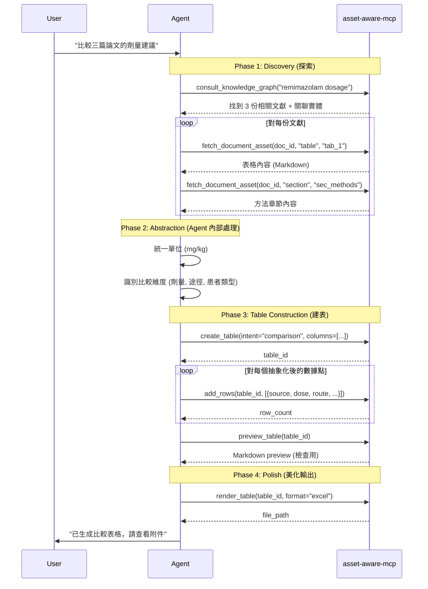

# A2T (Anything to Table) - asset-aware-mcp 內建功能模組
**Version:** 3.1.0 (Integrated MVP)  
**Date:** 2026-01-05  
**位置:** `src/application/table_service.py` + `src/presentation/server.py`
**依賴:** 整合於 asset-aware-mcp，共用 FastMCP 實例

---

## 0. 模組定位：asset-aware-mcp 的輸出層

### A2T 是什麼？

A2T **不是**獨立的 MCP Server，而是 **asset-aware-mcp 的內建功能**，負責將 Agent 從文獻中提取的資訊，結構化輸出為專業表格。

```
┌─────────────────────────────────────────────────────────────────┐
│                     asset-aware-mcp (單一 MCP Server)            │
├─────────────────────────────────────────────────────────────────┤
│                                                                 │
│  ┌─────────────────┐  ┌─────────────────┐  ┌─────────────────┐ │
│  │  📥 ETL 模組    │  │  🔍 查詢模組    │  │  📊 A2T 模組    │ │
│  │                 │  │                 │  │  (表格建構)      │ │
│  │ ingest_documents│  │ consult_kg      │  │ create_table    │ │
│  │ get_job_status  │  │ fetch_asset     │  │ add_rows        │ │
│  │ list_documents  │  │ inspect_manifest│  │ preview_table   │ │
│  │                 │  │                 │  │ render_table    │ │
│  └─────────────────┘  └─────────────────┘  └─────────────────┘ │
│                                                                 │
└─────────────────────────────────────────────────────────────────┘
```

### 為什麼整合而非獨立？

| 考量 | 獨立 MCP | 整合模組 ✅ |
|------|----------|-------------|
| 部署複雜度 | 需管理 2 個 Server | 單一 Server |
| Agent 配置 | 需連接多個 MCP | 一個 MCP 全搞定 |
| 資料共享 | 需跨 Server 傳遞 | 直接存取 manifest |
| 維護成本 | 高 | 低 |

---

## 1. Agent 工作流程 (單一 MCP)

### 1.1 完整流程圖



### 1.2 關鍵優勢

- **單一連接** — Agent 只需配置一個 MCP Server
- **資料共享** — A2T 可直接引用 document manifest 中的 doc_id
- **統一錯誤處理** — 所有錯誤格式一致

---

## 2. A2T MCP Tools (新增 7 個工具)

> **注意**: 這些工具將註冊到現有的 `asset-aware-mcp` Server，與現有工具並列。

### 2.1 Tool: `create_table`

```python
@mcp.tool()
def create_table(
    intent: Literal["comparison", "citation", "summary"],
    title: str,
    columns: list[dict],  # [{"name": "藥物", "type": "text"}, ...]
    source_description: str = ""
) -> str:
    """
    建立一張新表格，定義欄位結構。
    
    Returns:
        table_id + Markdown Preview
    """
```

### 2.2 Tool: `add_rows`

```python
@mcp.tool()
def add_rows(
    table_id: str,
    rows: list[dict]
) -> str:
    """
    新增資料列到表格（可多次呼叫）。
    
    Returns:
        執行結果 + Markdown Preview
    """
```

### 2.3 Tool: `update_row` (🆕 CRUD)

```python
@mcp.tool()
def update_row(
    table_id: str,
    index: int,
    row: dict
) -> str:
    """
    更新特定索引的資料列。
    
    Returns:
        執行結果 + Markdown Preview
    """
```

### 2.4 Tool: `delete_row` (🆕 CRUD)

```python
@mcp.tool()
def delete_row(
    table_id: str,
    index: int
) -> str:
    """
    刪除特定索引的資料列。
    
    Returns:
        執行結果 + Markdown Preview
    """
```

### 2.5 Tool: `list_tables` (🆕 CRUD)

```python
@mcp.tool()
def list_tables() -> str:
    """
    列出所有正在處理中的表格。
    """
```

### 2.6 Tool: `preview_table`

```python
@mcp.tool()
def preview_table(
    table_id: str,
    limit: int = 10
) -> str:
    """
    預覽表格內容（Markdown 格式）。
    """
```

### 2.7 Tool: `render_table`

```python
@mcp.tool()
def render_table(
    table_id: str,
    format: Literal["excel", "markdown", "html"] = "excel",
    filename: str = "output"
) -> str:
    """
    渲染最終輸出，自動套用美化。
    """
```

### 2.8 完整 Tool 清單 (整合後)

整合後的 asset-aware-mcp 將擁有以下工具：

| 類別 | Tool 名稱 | 說明 |
|------|-----------|------|
| **ETL** | `ingest_documents` | 匯入 PDF |
| **ETL** | `get_job_status` | 查詢任務進度 |
| **ETL** | `list_jobs` | 列出所有任務 |
| **查詢** | `list_documents` | 列出已處理文件 |
| **查詢** | `inspect_document_manifest` | 查看文件結構 |
| **查詢** | `fetch_document_asset` | 取得資產內容 |
| **查詢** | `consult_knowledge_graph` | 知識圖譜查詢 |
| **查詢** | `export_knowledge_graph` | 匯出知識圖譜 |
| **📊 A2T** | `create_table` | 建立表格 (含持久化) |
| **📊 A2T** | `add_rows` | 新增資料列 |
| **📊 A2T** | `update_row` | 更新資料列 |
| **📊 A2T** | `delete_row` | 刪除資料列 |
| **📊 A2T** | `list_tables` | 列出所有表格 |
| **📊 A2T** | `preview_table` | 預覽表格 |
| **📊 A2T** | `render_table` | 渲染輸出檔案 |

---

## 3. 持久化設計 (Persistence)

### 3.1 儲存路徑
- **JSON 狀態**: `data/tables/{table_id}.json` (包含完整 Schema 與資料)
- **Markdown 預覽**: `data/tables/{table_id}.md` (方便 Agent 或使用者直接讀取)
- **Excel 輸出**: `data/tables/{filename}_{timestamp}.xlsx`

### 3.2 CRUD 邏輯
- **Create**: 建立 JSON 與 MD 檔案。
- **Read**: 從記憶體 (快取) 或 JSON 讀取。
- **Update**: 修改記憶體資料並同步更新 JSON 與 MD。
- **Delete**: 刪除記憶體資料與實體檔案。

### 3.1 比較型 (comparison) - MVP 重點

```python
class ComparisonRow(BaseModel):
    """跨文獻比較的單列資料"""
    source: str                    # 來源文獻 (必填)
    entity: str                    # 比較主體 (如: 藥物名稱)
    dimension: str                 # 比較維度 (如: 劑量、副作用)
    value: str | float             # 數值或描述
    unit: str | None = None        # 單位 (可選)
    confidence: Literal["high", "medium", "low"] = "medium"  # 可信度
    note: str | None = None        # 備註
```

### 3.2 引用型 (citation)

```python
class CitationRow(BaseModel):
    """文獻引用"""
    source: str
    author: str
    year: int
    quote: str                     # 原文引用
    page: str | None = None
    relevance: int = Field(ge=1, le=5, default=3)  # 1-5 相關性
```

### 3.3 摘要型 (summary)

```python
class SummaryRow(BaseModel):
    """結構化摘要"""
    section: str                   # 章節
    key_point: str                 # 重點
    detail: str | None = None
    importance: Literal["critical", "important", "minor"] = "important"
```

---

## 4. 自動美化規則 (Visual Design)

### 4.1 Excel 輸出 (XlsxWriter)

| 元素 | 樣式 |
|------|------|
| **表頭** | 深灰底 (#2C3E50)、白字、粗體 |
| **文字對齊** | 垂直置頂、自動換行 |
| **欄寬** | 自動計算 (最大 50 字元) |

### 4.2 條件格式 (根據 intent)

**comparison 類型**：
- `confidence = "high"` → 淺綠底
- `confidence = "low"` → 淺紅底
- 數值欄位 → Excel Data Bars

**citation 類型**：
- `relevance >= 4` → 淺藍底
- `year` 欄位 → 降序排列

---

## 5. 專案結構 (整合至 asset-aware-mcp)

```plaintext
asset-aware-mcp/
├── src/
│   ├── domain/
│   │   ├── entities.py          # 現有實體
│   │   └── table_entities.py    # 🆕 TableContext, ColumnDef
│   ├── application/
│   │   ├── document_service.py  # 現有服務
│   │   ├── asset_service.py     # 現有服務
│   │   └── table_service.py     # 🆕 A2T 核心邏輯
│   ├── infrastructure/
│   │   ├── file_storage.py      # 現有儲存
│   │   └── excel_renderer.py    # 🆕 XlsxWriter 實作
│   └── presentation/
│       └── server.py            # 現有 + 🆕 A2T tools 註冊
├── data/
│   ├── doc_{id}/                # 現有文件儲存
│   └── tables/                  # 🆕 A2T 輸出目錄
└── tests/
    ├── unit/
    │   └── test_table_service.py  # 🆕 A2T 單元測試
    └── integration/
        └── test_a2t_workflow.py   # 🆕 A2T 整合測試
```

---

## 6. 環境與依賴

### 6.1 新增依賴 (加入現有 pyproject.toml)

```toml
# 在現有 dependencies 中新增
dependencies = [
    # ... 現有依賴 ...
    "xlsxwriter>=3.1.0",   # 🆕 Excel 輸出
]
```

### 6.2 輸出路徑配置

```python
# src/infrastructure/config.py 新增
TABLE_OUTPUT_DIR = DATA_DIR / "tables"

# 檔案命名規則
# {filename}_{timestamp}.{format}
# 例如: remimazolam_comparison_20260105_143000.xlsx
```

---

## 7. 完整資料結構定義

### 7.1 TableContext (記憶體儲存)

```python
from dataclasses import dataclass, field
from datetime import datetime
from typing import Literal

@dataclass
class ColumnDef:
    """欄位定義"""
    name: str
    type: Literal["text", "number", "date", "enum", "url"]
    required: bool = True
    enum_values: list[str] | None = None  # 僅 type="enum" 時使用

@dataclass
class TableContext:
    """表格上下文 - 存活於記憶體"""
    id: str                                    # UUID, 例如 "tbl_abc123"
    intent: Literal["comparison", "citation", "summary"]
    title: str
    columns: list[ColumnDef]
    rows: list[dict] = field(default_factory=list)
    source_description: str = ""
    created_at: datetime = field(default_factory=datetime.now)
    
    # 統計資訊
    @property
    def row_count(self) -> int:
        return len(self.rows)

# 全域儲存 (MVP: 單一 dict)
_tables: dict[str, TableContext] = {}
```

### 7.2 欄位類型說明

| type | 說明 | 驗證規則 | Excel 格式 |
|------|------|----------|------------|
| `text` | 文字 | 無限制 | 自動換行 |
| `number` | 數值 | int/float | 右對齊, Data Bars |
| `date` | 日期 | ISO 8601 | YYYY-MM-DD |
| `enum` | 列舉 | 必須在 enum_values 內 | 條件色彩 |
| `url` | 連結 | 有效 URL | 超連結樣式 |

---

## 8. API 輸入輸出範例 (JSON)

### 8.1 create_table

**輸入**:
```json
{
  "intent": "comparison",
  "title": "Remimazolam 劑量比較表",
  "columns": [
    {"name": "來源", "type": "text"},
    {"name": "適應症", "type": "text"},
    {"name": "給藥途徑", "type": "enum", "enum_values": ["IV", "IM", "PO"]},
    {"name": "劑量", "type": "number"},
    {"name": "單位", "type": "text"},
    {"name": "可信度", "type": "enum", "enum_values": ["high", "medium", "low"]},
    {"name": "備註", "type": "text", "required": false}
  ],
  "source_description": "來自 PubMed 的 3 篇 RCT 研究"
}
```

**輸出**:
```json
{
  "table_id": "tbl_a1b2c3d4",
  "message": "Table created successfully",
  "column_count": 7
}
```

### 8.2 add_rows

**輸入**:
```json
{
  "table_id": "tbl_a1b2c3d4",
  "rows": [
    {
      "來源": "Chen et al. 2023",
      "適應症": "程序性鎮靜",
      "給藥途徑": "IV",
      "劑量": 0.2,
      "單位": "mg/kg",
      "可信度": "high",
      "備註": "Phase III RCT"
    },
    {
      "來源": "Kim et al. 2024",
      "適應症": "ICU 鎮靜",
      "給藥途徑": "IV",
      "劑量": 0.3,
      "單位": "mg/kg",
      "可信度": "medium",
      "備註": null
    }
  ]
}
```

**輸出**:
```json
{
  "success": true,
  "added": 2,
  "total_rows": 2,
  "validation_warnings": []
}
```

### 8.3 preview_table

**輸入**:
```json
{
  "table_id": "tbl_a1b2c3d4",
  "limit": 5
}
```

**輸出**:
```json
{
  "markdown": "| 來源 | 適應症 | 給藥途徑 | 劑量 | 單位 | 可信度 | 備註 |\n|------|--------|----------|------|------|--------|------|\n| Chen et al. 2023 | 程序性鎮靜 | IV | 0.2 | mg/kg | high | Phase III RCT |\n| Kim et al. 2024 | ICU 鎮靜 | IV | 0.3 | mg/kg | medium | - |",
  "total_rows": 2,
  "showing": 2
}
```

### 8.4 render_table

**輸入**:
```json
{
  "table_id": "tbl_a1b2c3d4",
  "format": "excel",
  "filename": "remimazolam_comparison"
}
```

**輸出**:
```json
{
  "success": true,
  "format": "excel",
  "file_path": "./data/tables/remimazolam_comparison_20260105_143000.xlsx",
  "file_size_kb": 15.2,
  "row_count": 2
}
```

---

## 9. 錯誤處理

### 9.1 錯誤碼定義

| 錯誤碼 | 名稱 | 說明 | HTTP 類比 |
|--------|------|------|-----------|
| `E001` | TABLE_NOT_FOUND | table_id 不存在 | 404 |
| `E002` | VALIDATION_ERROR | 資料格式不符合 Schema | 400 |
| `E003` | COLUMN_MISMATCH | add_rows 的欄位與定義不符 | 400 |
| `E004` | ENUM_VALUE_INVALID | enum 值不在允許列表 | 400 |
| `E005` | RENDER_FAILED | 輸出渲染失敗 | 500 |
| `E006` | TABLE_EMPTY | 嘗試渲染空表格 | 400 |

### 9.2 錯誤回應格式

```json
{
  "success": false,
  "error": {
    "code": "E002",
    "message": "Validation error: '劑量' must be a number, got 'high'",
    "field": "劑量",
    "row_index": 1
  }
}
```

### 9.3 驗證警告 (非致命)

```json
{
  "success": true,
  "added": 2,
  "total_rows": 5,
  "validation_warnings": [
    {
      "row_index": 1,
      "field": "備註",
      "message": "Optional field is empty, will display as '-'"
    }
  ]
}
```

---

## 10. 測試案例

### 10.1 單元測試清單

```python
# tests/test_table_service.py

def test_create_table_returns_valid_id():
    """create_table 應返回有效的 table_id"""

def test_create_table_with_invalid_intent_raises_error():
    """無效的 intent 應拋出 E002"""

def test_add_rows_validates_required_fields():
    """缺少必填欄位應拋出 E002"""

def test_add_rows_validates_enum_values():
    """無效的 enum 值應拋出 E004"""

def test_add_rows_accumulates_correctly():
    """多次 add_rows 應正確累加"""

def test_preview_table_respects_limit():
    """preview 應遵守 limit 參數"""

def test_render_empty_table_raises_error():
    """渲染空表格應拋出 E006"""
```

### 10.2 整合測試場景

```python
# tests/test_e2e.py

def test_full_comparison_workflow():
    """
    完整流程測試：
    1. create_table (comparison)
    2. add_rows × 3 次
    3. preview_table
    4. render_final (excel)
    5. 驗證輸出檔案存在且可開啟
    """
```

---

## 11. MVP 開發路線圖

### Phase 1: 核心骨架 (1.5 天)
- [ ] 新增 `src/domain/table_entities.py` (TableContext, ColumnDef)
- [ ] 新增 `src/application/table_service.py`
- [ ] 實作 `create_table` 和 `add_rows`
- [ ] 在 `server.py` 註冊新工具

### Phase 2: 輸出引擎 (1.5 天)
- [ ] 新增 `src/infrastructure/excel_renderer.py`
- [ ] 實作 `preview_table` (Markdown 渲染)
- [ ] 實作 `render_table` (Excel 輸出)
- [ ] 實作條件格式 (enum 色彩、Data Bars)

### Phase 3: 整合測試 (1 天)
- [ ] 撰寫 `tests/unit/test_table_service.py`
- [ ] 撰寫 `tests/integration/test_a2t_workflow.py`
- [ ] 端對端測試：探索 → 提取 → 建表 → 輸出
- [ ] 更新 README 說明新工具

### 新增檔案清單

| 檔案 | 類型 | 說明 |
|------|------|------|
| `src/domain/table_entities.py` | 🆕 | TableContext, ColumnDef 定義 |
| `src/application/table_service.py` | 🆕 | A2T 核心業務邏輯 |
| `src/infrastructure/excel_renderer.py` | 🆕 | XlsxWriter 封裝 |
| `tests/unit/test_table_service.py` | 🆕 | 單元測試 |
| `tests/integration/test_a2t_workflow.py` | 🆕 | 整合測試 |

### 修改檔案清單

| 檔案 | 修改內容 |
|------|----------|
| `src/presentation/server.py` | 註冊 4 個新 A2T tools |
| `src/infrastructure/config.py` | 新增 TABLE_OUTPUT_DIR |
| `pyproject.toml` | 新增 xlsxwriter 依賴 |

---

## 12. 使用範例：Agent 提示詞

```markdown
## 任務：比較三篇論文中的 Remimazolam 劑量建議

### 步驟 1: 資料探索
使用 `consult_knowledge_graph` 查詢 "remimazolam dosage" 相關文獻。

### 步驟 2: 資料提取
對每份文獻使用 `fetch_document_asset` 提取：
- 表格資產 (如有)
- 方法章節

### 步驟 3: 抽象化 (Agent 內部處理)
統一劑量單位為 mg/kg，識別：
- 適應症
- 給藥途徑
- 患者類型

### 步驟 4: 建立表格
使用 `create_table`:
- intent: "comparison"
- columns: [source, indication, route, dose, unit, patient_type, note]

### 步驟 5: 填充資料
多次呼叫 `add_rows`，每處理完一份文獻就新增一批。

### 步驟 6: 預覽檢查
使用 `preview_table` 確認資料正確。

### 步驟 7: 輸出
使用 `render_table(format="excel")` 產生最終報表。
```

> **注意**: 所有工具都來自同一個 `asset-aware-mcp` Server，Agent 無需切換連接。

---

## 13. 未來擴展 (Post-MVP)

| 功能 | 優先級 | 說明 |
|------|--------|------|
| DuckDB 中間層 | P1 | 支援大量資料與 SQL 查詢 |
| HTML 互動輸出 | P1 | Great Tables 整合 |
| 圖表生成 | P2 | 自動生成比較圖 |
| 多表關聯 | P2 | 支援多張表的交叉引用 |
| 版本歷史 | P3 | 追蹤表格修改記錄 |

---

**設計原則總結**：
1. **單一 MCP Server** — 所有功能整合於 asset-aware-mcp
2. **Agent 是大腦** — 理解、抽象化、決策
3. **MCP 是雙手** — 驗證、儲存、美化
4. **多次呼叫** — 漸進式構建，非一次性輸出
5. **Schema 即契約** — Pydantic 確保資料品質
6. **DDD 架構** — 遵循現有專案的分層設計
