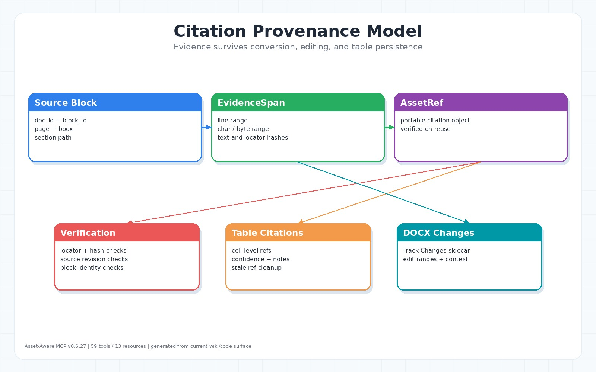

# Citation Provenance



## 目標

Citation-ready 在此專案中表示：每個引用都能追溯到具體文件、block/span、locator、hash 與周邊 context。不能只保存一段文字，因為文件轉換、OCR、DFM 編輯或 table persistence 都可能讓 locator 漂移。

來源：`src/domain/citation.py`、`src/application/citation_artifacts.py`、`src/application/citation_index_service.py`、`src/presentation/tools/citation_support.py`、`src/presentation/tools/document_tools.py`、`src/domain/table_entities.py`。

## EvidenceSpan

EvidenceSpan 是引用候選片段，通常由 PDF ingest、segmentation 或 citation index rebuild 產生。它保存：

- document id
- span id
- block id
- page
- line range
- char/byte range
- bbox
- section
- quote/text hash
- locator version
- source revision
- locator source hash

## AssetRef

AssetRef 是工具間傳遞引用的 compact object。`verify_citation_ref(ref)` 會檢查 ref 是否仍符合現有 citation index，包含：

- block identity 是否存在。
- page/line/char/byte/bbox locator 是否一致。
- ref 有提供 `locator_source_sha256` 時，檢查 locator source hash 是否一致。
- quote/text hash 是否匹配。
- source revision 是否 stale。

`0.6.27` 已修正 AssetRef serialization/reload 會掉 `locator_source_sha256` 的問題。

## Citation Index

`CitationIndexService` 負責建立或重建 `citation_index.jsonl`，並用 `citation_index.status.json` 記錄 build/rebuild 狀態。當 canonical Markdown revision hash 或 locator version 改變時，cache 會被視為 stale 並重建。

## Table Citation

A2T table cell 可掛 citation refs。當 cited cell 或 row 被更新時，舊 citation 會被移除或標示 stale，避免把修改後的數值繼續指向舊來源。

相關工具：

- `table_cite`
- `find_evidence_spans`
- `verify_citation_ref`
- `evidence(op="find" | "verify" | "locate")`

實務上，PDF 引用優先使用 `find_evidence_spans` 回傳的 AssetRef；`discover_sources` 適合先找表格可抽取來源，但它的 span ref 目前較偏 discovery payload，正式引用仍建議再走 `find_evidence_spans` / `verify_citation_ref`。

## DOCX Citation Safety

DOCX save path 會檢查 DFM checksum、doc id drift、pre-save integrity、post-save integrity。Track Changes sidecar `revisions.jsonl` 會保存文字修改的 locator context，讓 Word review 和 citation audit 可以對齊。

## 實務建議

引用時優先保存 `AssetRef`，不要只貼文字。對人工文件說明，建議至少記錄：

```text
doc_id
block_id 或 span_id
page
line range
char/byte range
quote/text hash
context
```
