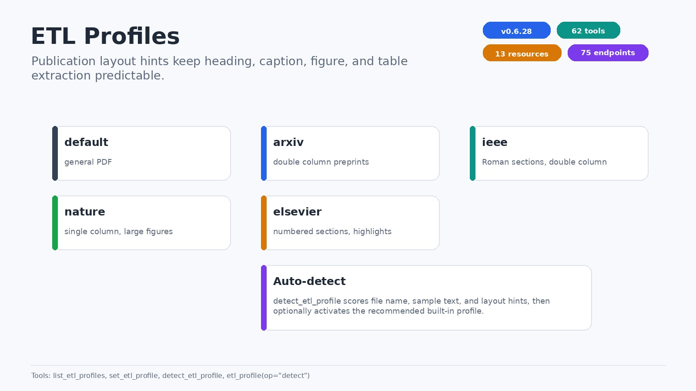

# ETL Profiles



## 目的

ETL profile 控制 heading detection、caption/table/figure filters、section keyword、numbered section pattern 與出版格式差異。它讓同一套 PDF ingest pipeline 可以適應 arXiv、Nature、IEEE、Elsevier 等格式。

來源：`src/domain/etl_profile.py`、`src/application/etl_profile_detector.py`、`src/presentation/tools/profile_tools.py`。

## 內建 profiles

| Profile | 說明 |
|---|---|
| `default` | 通用 PDF |
| `arxiv` | double-column、bold numbered sections、通常沒有 PDF TOC |
| `nature` | Nature/Scientific Reports，single-column、大圖 |
| `ieee` | double-column、Roman numeral sections |
| `elsevier` | single-column、numbered sections、highlights |

## Tools

| Tool | 用途 |
|---|---|
| `list_etl_profiles` | 列出 profiles |
| `get_etl_profile` | 檢視 profile |
| `get_current_etl_profile` | 查詢 active profile |
| `set_etl_profile` | 切換 active profile |
| `load_etl_profile_from_json` | 載入自訂 JSON profile |
| `detect_etl_profile` | 從 PDF、已攝入 doc_id 或 sample text 偵測建議 profile，可選擇立即 activate |
| `etl_profile` | consolidated profile entrypoint |

## Auto Detect

```text
detect_etl_profile(pdf_path="/path/paper.pdf", sample_pages=3)
detect_etl_profile(doc_id="doc_...", activate=true)
etl_profile(op="detect", sample_text="...", activate=false)
```

Profile detector 會從檔名、sample text 與版面 hints 推估 `default`、`arxiv`、`ieee`、`nature`、`elsevier`，並回傳 `recommended_profile`、`confidence`、`scores` 與 reasons。`activate=true` 會在偵測後切換 active profile；若只是想檢查建議，保持預設 `activate=false`。

## 自訂 profile

JSON profile 可繼承 built-in base，並覆寫：

- font thresholds
- heading noise patterns
- section keywords
- table/figure caption regex
- min figure/table filters
- numbered section regex

Profile 切換只影響後續 ingest，不會重寫既有 document artifacts。已建立的 background job 會保存 job creation 時的 profile context，並傳入 isolated worker，避免中途切換造成同一個 job 的 heading/caption/filter 規則漂移。`load_etl_profile_from_json` 只負責註冊自訂 profile；若要立即使用，仍需再呼叫 `set_etl_profile`。
