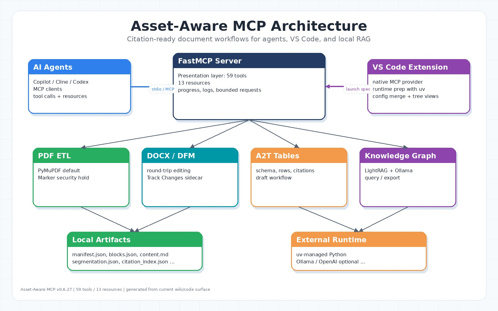

# Asset-Aware MCP Wiki

Asset-Aware MCP 是一個 citation-ready 文件處理與知識工作流 MCP Server。它的核心目標是把 PDF、DOCX、DFM、表格、圖片、OCR、LightRAG 知識圖譜與 VS Code extension 串在一起，同時保留可追溯的來源身份、locator、hash 與 context。

目前版本真相：

| 項目 | 狀態 |
|---|---|
| 最新程式版本 | `0.6.27` |
| Python | `>=3.10`，以 `uv` 管理 |
| MCP endpoints | 59 tools、13 resources，共 72 endpoints |
| PDF 後端 | 預設 PyMuPDF；Marker backend 在 `0.6.27` 因 `Pillow` 安全相容性暫時 hold |
| DOCX | DOCX/DOC/DFM round trip、Track Changes、LibreOffice conversion、strict validation |
| Knowledge graph | LightRAG (`lightrag-hku`) + Ollama/OpenAI 可插拔後端 |
| VS Code extension | 內建 MCP provider、Cline/Codex/Copilot config merge、assistant harness sync |

來源錨點：`pyproject.toml`、`CHANGELOG.md`、`src/presentation/tools/**`、`src/presentation/resources/**`、`vscode-extension/src/**`。

## 快速入口

- [Getting Started](Getting-Started)
- [Architecture](Architecture)
- [MCP Tools](MCP-Tools)
- [MCP Resources](MCP-Resources)
- [PDF Document Workflow](PDF-Document-Workflow)
- [DOCX DFM Workflow](DOCX-DFM-Workflow)
- [Citation Provenance](Citation-Provenance)
- [A2T Tables](A2T-Tables)
- [Knowledge Graph](Knowledge-Graph)
- [Background Jobs](Background-Jobs)
- [ETL Profiles](ETL-Profiles)
- [VS Code Extension And MCP Setup](VS-Code-Extension-And-MCP-Setup)
- [Git Harness Hygiene](Git-Harness-Hygiene)
- [Developer Guide](Developer-Guide)
- [Release And Testing](Release-And-Testing)
- [Code Map](Code-Map)

## 主要工作流

| 工作流 | 用途 | 主要入口 |
|---|---|---|
| PDF ingestion | 產生 `manifest.json`、`content.md`、資產與 segmentation | `ingest_documents`、`document(op="ingest")` |
| Citation evidence | 找出可引用 span、驗證 AssetRef | `find_evidence_spans`、`verify_citation_ref`、`evidence(...)` |
| DOCX/DFM editing | 將 Word 轉為 DFM、編輯後保真寫回 | `ingest_docx`、`save_docx`、`docx(...)` |
| Table extraction | 建立 A2T TableContext、附來源引用、渲染輸出 | `plan_table`、`table_manage`、`table_data`、`table_cite` |
| Knowledge graph | 跨文件 LightRAG 查詢與匯出 | `consult_knowledge_graph`、`export_knowledge_graph` |
| Async jobs | 將長任務移出 MCP request path | `get_job_status`、`list_jobs`、`cancel_job` |
| VSIX setup | 安裝 MCP provider 與 assistant harness | VS Code extension commands and settings |

## 文件更新原則

Wiki 以目前 `origin/master` 程式碼為準，不從記憶重建工具數量。工具與資源數量來自 `./scripts/count_tools.sh`，功能說明對應目前 `src/presentation/tools` 與 `src/presentation/resources` 的公開 MCP surface。
