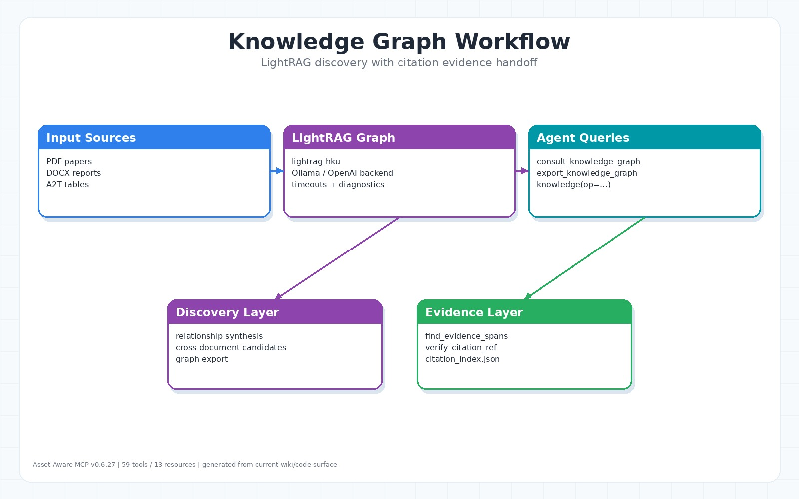

# Knowledge Graph



## Runtime Defaults

- Local RAG/text generation defaults to `OLLAMA_MODEL=granite4.1:3b` for CPU-friendly installs.
- GPU installs can set `ASSET_AWARE_HAS_GPU=true` (or run with `NVIDIA_VISIBLE_DEVICES` / `CUDA_VISIBLE_DEVICES`) to default to `OLLAMA_MODEL=granite4.1:8b`.
- Ollama embeddings stay on `OLLAMA_EMBEDDING_MODEL=nomic-embed-text` for KG/vector storage.
- LightRAG/KG is opt-in: keep `ENABLE_LIGHTRAG=false` for CPU-only or document-only workflows, and set it to `true` only when the KG backend and required Ollama models are installed.

CPU-only deployment can still use Ollama for small local models. A conservative setup is:

```env
LLM_BACKEND=ollama
OLLAMA_MODEL=granite4.1:3b
OLLAMA_EMBEDDING_MODEL=nomic-embed-text
ENABLE_LIGHTRAG=false
```

For GPU-backed workstations, use:

```env
ASSET_AWARE_HAS_GPU=true
OLLAMA_MODEL=granite4.1:8b
```

Enable KG only after both the LLM model and embedding model are pulled:

```bash
ollama pull granite4.1:3b
# or, on GPU installs:
ollama pull granite4.1:8b
ollama pull nomic-embed-text
```

KG indexing is opt-in. A KG-ready smoke flow is:

```env
ENABLE_LIGHTRAG=true
LLM_BACKEND=ollama
OLLAMA_MODEL=granite4.1:3b
OLLAMA_EMBEDDING_MODEL=nomic-embed-text
```

Restart the MCP server after changing these values, then ingest with KG indexing explicitly enabled:

```text
ingest_documents(
  file_paths=["/papers/trial.pdf"],
  async_mode=true,
  index_knowledge_graph=true
)
get_job_status(job_id="...")
export_knowledge_graph(format="summary", limit=20)
```

Only continue to `consult_knowledge_graph(...)` after the summary shows graph content. A normal
`ingest_documents(...)` call keeps `index_knowledge_graph=false`, so it will not populate LightRAG.

For KG indexing on CPU, expect it to be useful for discovery, clustering, and candidate relation extraction; keep citation-critical claims anchored to evidence spans.

## 角色

Knowledge graph 由 LightRAG 提供，用於跨文件查詢、關聯摘要與圖譜匯出。它不是 citation locator 的唯一來源；citation-ready locator 仍以 document artifacts、segmentation 與 citation index 為準。

來源：`src/application/knowledge_service.py`、`src/infrastructure/lightrag_adapter.py`、`src/presentation/tools/knowledge_tools.py`。

## 呈現方式

KG 查詢本身回傳 structured/data/text payload，不會把 graph 當成唯一引用來源。對人類可讀的 wiki 呈現通常走兩條路：

| 情境 | 建議輸出 |
|---|---|
| Agent 要立刻使用 KG 結果 | `consult_knowledge_graph(response_mode="structured", verify_references=true)`，回傳 answer、references、`verified_evidence` |
| 要寫入 Foam/LLM wiki | 先讀 [LLM Wiki Knowledge Base](LLM-Wiki-Knowledge-Base)，再用 KG 找候選主題，最後用 `citation_bundle(..., output_format="foam")` 或 `document_asset(op="foam_notes", ...)` 產生帶 wiki link / evidence pack 的 Markdown |
| 要視覺化關係 | `export_knowledge_graph(format="json")` 匯出 graph data，再交給外部圖譜或網站渲染 |

因此 wiki link 是文件 synthesis 層的呈現格式；KG 是 discovery layer，citation index/evidence bundle 才是可驗證證據層。

## 查詢

```text
consult_knowledge_graph(
  query="...",
  mode="hybrid",
  response_mode="structured",
  include_references=true,
  verify_references=true,
  doc_ids=["doc_..."],
  evidence_limit=5
)
```

`response_mode` 只接受 `structured`、`data`、`text`。`structured` 是預設，會回傳 MCP-friendly payload；`data` 只回傳 retrieval data；`text` 保留舊版純文字行為。`knowledge(op="consult", ...)` 是 consolidated entrypoint。

`0.6.28` 起，`verify_references=true` 會把 KG answer 連回 citation index：工具會從 `doc_ids` 或回傳內容中的文件 id 候選，呼叫 verified evidence bundle 流程，並在 structured/data payload 內附上 `verified_evidence`；text 模式則會把「Verified Evidence」區塊附在答案後面。這讓 KG 仍保持 discovery layer，但輸出可以直接帶著可驗證 span、locator、hash、context 與 CRAAP scaffold。

## 匯出

```text
export_knowledge_graph(format="json", limit=100)
```

可用於視覺化、外部分析或 wiki synthesis。

## 後端與安全行為

目前 LightRAG adapter 會：

- 驗證 `lightrag-hku` distribution。
- 支援 Ollama embeddings batch `/api/embed`，並提供 legacy fallback。
- 透過 `.env` / environment 設定 `ENABLE_LIGHTRAG`、`LLM_BACKEND`、`OLLAMA_HOST`、`OLLAMA_MODEL`、`OLLAMA_EMBEDDING_MODEL`、`OLLAMA_LLM_TIMEOUT`、`OLLAMA_EMBEDDING_TIMEOUT`、`OPENAI_API_KEY`、`LIGHTRAG_EMBEDDING_MODEL` 與 `LIGHTRAG_WORKING_DIR`。
- `consult_knowledge_graph` / `export_knowledge_graph` 有固定 45 秒 MCP request guard；Ollama LLM/embedding 呼叫本身仍使用上述 timeout knobs。
- 在 LightRAG/Ollama 不可用時回傳 bounded diagnostic，而不是無限等待。

## 和 Citation 的關係

KG 適合回答「跨文件有哪些關係」。若要產出可引用結論，流程應回到：

```text
KG query -> source candidates -> citation_bundle -> verify_citation_ref
```

也就是說，KG 是 discovery layer；citation index 是 evidence layer。若已知道文件 id，可直接用 `consult_knowledge_graph(..., verify_references=true, doc_ids=[...])`；若要人工審查或匯出給外部流程，則用 `citation_bundle(output_format="json")` 取得完整 evidence package。
