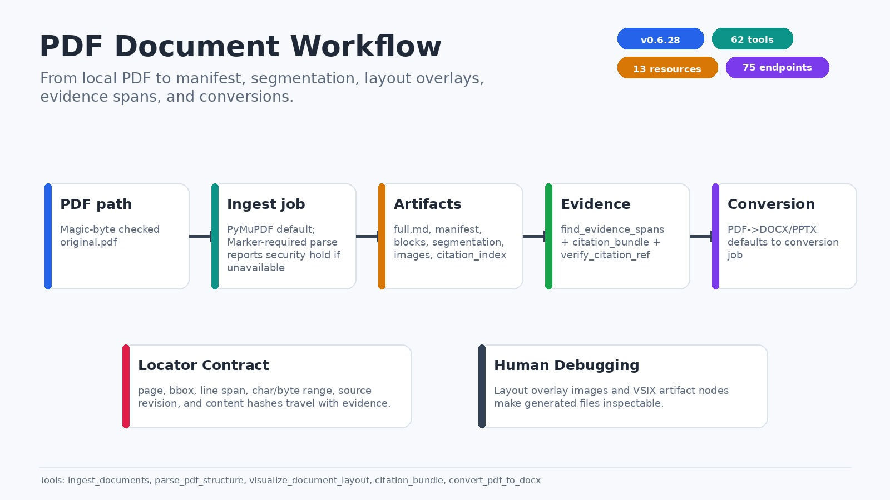

# PDF Document Workflow



## 目的

PDF pipeline 將原始 PDF 轉成可檢索、可視覺化、可引用的文件 artifacts。它不是單純抽文字，而是同時保存 document identity、assets、section structure、layout locator、reading order、line/char/byte spans 與 citation hash。

來源：`src/domain/pdf_preflight.py`、`src/application/pdf_preflight_service.py`、`src/application/document_service.py`、`src/infrastructure/pymupdf_preflight.py`、`src/infrastructure/pdf_extractor.py`、`src/infrastructure/{docling,pymupdf4llm}_adapter.py`、`src/infrastructure/extractor_factory.py`、`src/application/segmentation_service.py`、`src/presentation/tools/document_tools.py`。

## Preflight 與路由

在 ingest 前可先執行：

```text
document(op="preflight", pdf_path="/absolute/path/to/source.pdf")
```

這是唯讀、非持久化的 PDF inspection operation。它計算來源 identity、逐頁 layout signals、OCR 建議與 extraction route，但不會執行 OCR、Docling 或正式 ingest，也不會改寫來源檔案。成功回傳固定的 `pdf-preflight-v1` schema：

| 欄位 | 意義 |
|---|---|
| `schema_version`, `status` | 固定為 `pdf-preflight-v1`, `ok` |
| `source` | `filename`、`size_bytes` 與原始 bytes 的 `sha256` |
| `inspector` | inspector 名稱、`pymupdf` backend 與 backend version |
| `coordinate_system` | 明確的頁碼、座標原點、單位與 bbox contract |
| `page_count`, `classification_counts` | 文件頁數及五種 classification 的完整計數 |
| `ocr_recommended`, `ocr_pages` | 文件層 OCR 判定與需要 OCR 的 1-based pages |
| `recommended_engine` | 文件層 route：`pymupdf`、`pymupdf+ocr` 或 `docling` |
| `pages[]` | 逐頁 locator、metrics、classification、OCR reasons 與 route |

每個 `pages[].locator` 都使用 **1-based page number**。`page_bbox` 與 `content_bbox` 是 `[x0, y0, x1, y1]`、單位為 PDF points、原點在頁面左上、x 向右、y 向下，並以 **unrotated crop box** 為座標基準；頁面旋轉另存於 `rotation_degrees`，不可把它混入 locator 座標。失敗時回傳同版本的 `status=error`、typed `error_code` 與 `message`。

### Classification、OCR reasons 與 route

Preflight 是 deterministic heuristic，不是模型信心分數。它使用搜尋文字量、word/block counts、raster image coverage 與 vector drawing counts 分類：

| Classification | 判定語意 | 一般 route |
|---|---|---|
| `native` | 有足夠且非疑似亂碼的 searchable text，沒有顯著 visual region | `pymupdf` |
| `sparse` | searchable text 不足且沒有顯著 visual region；真正空白頁也屬此類 | 有 OCR reason 才用 `pymupdf+ocr`，空白頁維持 `pymupdf` |
| `image` | 有顯著 raster/vector visual，但不像全頁掃描件且沒有足夠 native text | 通常 `pymupdf+ocr`；純 vector route 可升至 `docling` |
| `scanned` | 沒有足夠 native text，且最大 raster image 覆蓋至少 72% 頁面 | `pymupdf+ocr` |
| `hybrid` | 同頁同時有文字與顯著 visual content | `docling` |

「足夠 native text」目前是非疑似亂碼，且至少 60 個非空白字元，或至少 30 個非空白字元加 5 個 words；「顯著 visual」是最大 raster image 覆蓋至少 18%，或至少 4 個 vector drawings。這些數值屬於 `pdf-preflight-v1` routing policy，不可解讀成內容正確率。

逐頁 `ocr_reasons` 只使用下列固定值：

- `no_text`：visual page 沒有可見文字。
- `sparse_text`：有少量文字，但不足以視為可靠 native text。
- `image_dominant`：最大 raster image 覆蓋至少 45%。
- `suspected_scanned_page`：符合全頁掃描件條件。
- `suspected_garbled_text`：文字含高比例 replacement/control/private-use/surrogate characters。
- `vector_only`：沒有 raster image，但有足夠 vector drawings 且缺少可靠 native text。

`ocr_recommended` 必須和 reasons 是否為空一致。文件層 route 取逐頁最高需求：有 `docling` page 時選 `docling`，否則有 OCR page 時選 `pymupdf+ocr`，其餘選 `pymupdf`。這只是下一步建議；caller 仍須明確啟動 ingest/OCR。

### Process 與 resource guard

預設 preflight 在獨立 `spawn` 子程序執行，wall timeout 為 20 秒。輸入上限為 256 MiB、2,000 pages，且每頁的 words、raster images、vector drawings 各自不得超過 100,000 筆；Linux worker 另有 best-effort 1.5 GiB address-space cap。它會檢查開頭 `%PDF-` signature、拒絕未解密 PDF，並在 parse 前後比較 stat 與 SHA-256，來源中途改變時回傳 `source_changed`。

Preflight **不是 PDF sanitizer、malware scanner 或完整格式驗證器**。它不會移除 JavaScript、embedded files、actions、prompt-injection text 或其他 active content，也不會修復或解密 PDF。Process isolation 與 resource caps 只降低 parser failure/DoS 的影響；不代表檔案安全，也不能取代既有 `document(op="safety_audit")` artifact 或外部 sandbox/security scan。

## Ingest

主要工具：

- `document(op="auto", file_paths=[...])`
- `document(op="ingest", ...)` or `ingest_documents(...)` when a shortcut is preferred
- `parse_pdf_structure(...)`，歷史名稱保留、實際使用目前設定的 structured extractor；Docling 可用，held backend 會 fail closed

預設後端是 core dependency PyMuPDF。啟用中的 PDF optional extras 只有：

- `pdf-plus`：PyMuPDF4LLM，同生態的 layout-aware drop-in 升級。
- `docling`：MIT 授權的 structured layout/table/formula/figure engine；安裝方式見 `docs/docling-setup.md`。

`mineru` 與 `marker` adapters 仍保留，但兩個 extras 都是空的 **security hold**，不屬於 active install path。MinerU 3.4.4 的 `transformers<5` 上限與目前 `transformers>=5.5` security floor 衝突；Marker PDF 1.10.2 的 `Pillow<11` 上限則與 `Pillow>=12.2.0` security floor 衝突。不得以放寬 security floor 的方式啟用它們。`pdf` 也是空的相容 placeholder，不是第三個 active engine extra。

所有 optional adapters 都採 lazy import。`parse_pdf_structure(...)` 是保留舊 command ID 的 configured-structured shortcut；設定 `ETL_ENGINE=docling` 時使用 active Docling，Marker／MinerU security hold 或 backend unavailable 時會在建立 job 前回傳明確診斷。一般 `ingest_documents(use_marker=true)` 只代表偏好 composition root 已配置的結構化引擎，公開工具沒有 `require_marker` 參數，引擎不可用時會走 PyMuPDF 安全流程。

### `firecrawl/pdf-inspector` 借鑑範圍

Preflight 的 staged inspection、逐頁 OCR reasons、bounded work 與 extraction routing 借鑑自 `firecrawl/pdf-inspector`，研究基準固定在 [`076183e2e40a2ea71f9e04def182ea9984a1e50e`](https://github.com/firecrawl/pdf-inspector/commit/076183e2e40a2ea71f9e04def182ea9984a1e50e)。可對照其 pinned [`README.md`](https://github.com/firecrawl/pdf-inspector/blob/076183e2e40a2ea71f9e04def182ea9984a1e50e/README.md)、[核心 processing flow](https://github.com/firecrawl/pdf-inspector/blob/076183e2e40a2ea71f9e04def182ea9984a1e50e/src/lib.rs#L3882) 與 [detector constants/types](https://github.com/firecrawl/pdf-inspector/blob/076183e2e40a2ea71f9e04def182ea9984a1e50e/src/detector.rs#L14)。本專案沒有複製其混合 0/1-based API、座標慣例或 Markdown-only output；所有結果先正規化成上述 citation-safe schema。

目前也**不依賴** `pdf-inspector`。官方發布的 [PyPI 1.14.1](https://pypi.org/project/pdf-inspector/1.14.1/) 早於 main 上後續的 DoS hardening；尤其 pinned commit [`076183e`](https://github.com/firecrawl/pdf-inspector/commit/076183e2e40a2ea71f9e04def182ea9984a1e50e) 才把 content-stream operation cap 移到 decode/allocation 之前。這不是宣稱 1.14.1 有特定 CVE，而是發布包尚未包含已知 upstream hardening，因此不能成為處理不可信 PDF 的 production dependency。未來只有在正式 release/sdist 包含這些 fixes 並通過本 repo 的 hostile-fixture gate 後才重新評估。

### 混合格式批次攝入

當 `file_paths` 混合 PDF 與 DOCX/DOC/ODT/ODS 時，`document(op="auto"/"ingest"/"import", file_paths=[...])` 會自動偵測並改走單一 background job（`mixed_ingest_support.py` + `create_conversion_job`），每個檔案仍使用其對應的正確引擎（PDF 走 `DocumentService`、DOCX 家族走 `DocxService`）。單一檔案失敗不會中斷整批次，`get_job_status(job_id)` 會顯示 `[i/N filename]` 逐檔進度；只要批次中有任何檔案失敗，整個 job 會標記為 `FAILED` 並附上失敗清單，但已成功的文件仍完整保留可用。這個能力不會增加公開工具數（仍是 30 個）。

## 產物

| Artifact | 用途 |
|---|---|
| `original.pdf` | 原始 PDF copy，layout overlay 與 locator 對照使用 |
| `{doc_id}_full.md` | 人可讀與 LLM chunk-friendly 全文 |
| `{doc_id}_manifest.json` | 文件 identity、pages、figures、tables、sections、metadata |
| `blocks.json` | block-level layout/text/source backend metadata |
| `segmentation.json` | reading order、line range、char/byte range、hash、source revision |
| `ai_safety_report.json` | artifact-only PDF AI safety audit for tiny/white/off-page/prompt-injection text findings |
| `native_structure.json` | lightweight native PDF structure report: metadata, outline, page geometry, links/forms, tag-tree signals |
| `segmentation_coverage.json` | coverage audit for bbox, line/char/byte spans, asset links, reading-order gaps, and skipped-large-artifact status |
| `accessibility_report.json` | accessibility/readability readiness report for captions, bbox/caption coverage, sectioning, line spans, asset links, and reading-order gaps |
| `section_pointer_index.jsonl` | section-level structural pointer index with breadcrumbs, locators, hashes, assets, and evidence-span IDs |
| `citation_index.jsonl` | citation-ready evidence spans |
| `citation_index.status.json` | citation index build/rebuild status |
| `images/` | 圖片與 page/region assets |
| `ocr/`, `pages/` | optional OCR、page image 或 conversion artifacts |

這些 artifact 預設落在 `$DATA_DIR/{doc_id}/`。A2T 的 durable table files 則位於 `$DATA_DIR/tables/`；PDF table 結構本身主要透過 manifest、blocks 與 segmentation 讀取。

## OCR

`ocr_pdf_document(...)` 會建立 background job，並透過 `src/infrastructure/ocr_processor.py` 包裝 `ocrmypdf`。支援：

- `language`
- `rotate_pages`
- `deskew`
- `output_path`

OCR 後的 PDF 可再進入正常 ingest。

在 background job 模式下，`ocr_pdf_document(output_path=...)` 保留為相容參數；實際可追蹤輸出以 job result/artifacts 為準。

## Segmentation

`export_document_segmentation(...)` 將 manifest、blocks、assets 與 reading order 合併成 schema。它同時保留：

- `reading_order`：內容理解順序。
- `line_start` / `line_end`：Markdown locator。
- `char_range` / `byte_range`：精準引用。
- `source_revision` / `locator_version`：locator schema 版本。
- `text_sha256` / `locator_source_sha256`：內容與 locator source hash。

## Safety, Structure, And Coverage Audits

OpenDataloader-PDF inspired audit artifacts are generated as document artifacts without adding new public MCP tools and without mutating extracted text. Ingest creates them best-effort after core citation artifacts are saved; failures become ingest warnings. The `document(op=...)` audit operations can rebuild them or write a non-reserved report path.

- `document(op="auto", file_paths=[...])` chooses the normal ingest path. `document(op="auto", doc_id="...")` chooses the readiness path for an already-ingested document.
- `document(op="prepare_ai", doc_id="...")` reports whether the document has markdown, blocks, segmentation, citation index, safety audit, native structure, coverage, accessibility, and section pointer artifacts. Use `output_format="json"` to get the v2 readiness contract directly: `status`, `blockers`, `warnings`, `capabilities`, `artifacts`, and `next_actions`.
- `document(op="audit", doc_id="...")` runs safety, native structure, coverage, and accessibility diagnostics together without adding a public MCP tool. It skips current artifacts by default; pass `refresh=true` to rebuild all four reports.
- `document(op="safety_audit", doc_id="...")` writes `ai_safety_report.json`. It flags suspicious PDF text spans such as tiny text, white or near-white text, off-page text, zero-area text, and prompt-injection-style instructions. Findings include page, bbox, severity, reason, preview, and span hash.
- `document(op="native_structure", doc_id="...")` writes `native_structure.json`. It reports PyMuPDF-visible metadata, outline, page geometry, link/form counts, catalog keys, and best-effort tag-tree/language signals. It is not a PDF/UA compliance claim.
- `document(op="coverage", doc_id="...")` writes `segmentation_coverage.json`. It summarizes bbox coverage, line/char/byte span coverage, asset link coverage, reading-order gaps, and whether large block artifacts were skipped by the safe loading cap.
- `document(op="accessibility", doc_id="...")` writes `accessibility_report.json`. It is a conservative accessibility/readability readiness report, not a PDF/UA certification.
- `document(op="pointer_index", doc_id="...")` writes `section_pointer_index.jsonl` for deterministic structural retrieval.
- `document(op="structural_retrieve", doc_id="...", query="...")` searches existing valid section proxies and materializes bounded section previews while preserving locator/hash provenance. Use `document(op="pointer_index")` or `refresh=true` when the index is missing or stale.
- `document(op="compare", doc_id="...", doc_b_id="...", criteria="...")` writes a deterministic structural comparison bundle for review.

These reports are artifact-only diagnostics. They do not remove source content, loosen citation locator integrity, or change `segmentation.json` / `citation_index.jsonl` semantics. Readiness and job-status artifact discovery are read-only, so checking a job or document state does not create document directories. Completed ingest jobs include the audit artifacts when present and point the agent to `document(op="prepare_ai", doc_id="...")` for the next step.

## Layout Visualization

`visualize_document_layout(...)` 會產生 page overlay，用於檢查 bbox、block type、labels 與 reading order。它對 debugging same-page assets、wrong block pairing、OCR artifacts 特別有用。

## Search And Fetch

| Tool | 用途 |
|---|---|
| `search_source_location` / `evidence(op="locate")` | 依文字查 page/bbox/block source locator |
| `find_evidence_spans` | 找 citation-ready spans |
| `verify_citation_ref` | 驗證引用 ref 是否仍有效 |
| `citation_bundle` | 匯出 verified evidence bundle，含 AssetRef、locator、hash、context 與 verification |
| `fetch_document_asset` | 擷取 table/figure/section/full_text |
| `document_asset(op="get" | "foam_notes")` | consolidated asset fetch 與 table/figure Foam note 入口 |
| section tools / `document_asset(op="tree" | "detail" | "blocks" | "search")` | section tree/detail/blocks/search/content 導覽 |

## Conversion

`convert_pdf_to_docx` 與 `convert_pdf_to_pptx` 以已攝入 artifacts 為來源，支援 `output_path`、conversion `mode` 與 `async_mode`。預設 `async_mode=true` 會建立 background conversion job，使用 `get_job_status(job_id)` 追蹤 output artifact；若需要舊式同步結果，可設 `async_mode=false`。

對於跨格式入口，使用 `convert_document(...)`；Markdown 直接輸出則使用 DOCX workflow 的 `export_markdown(...)`，同樣預設走 conversion job。
