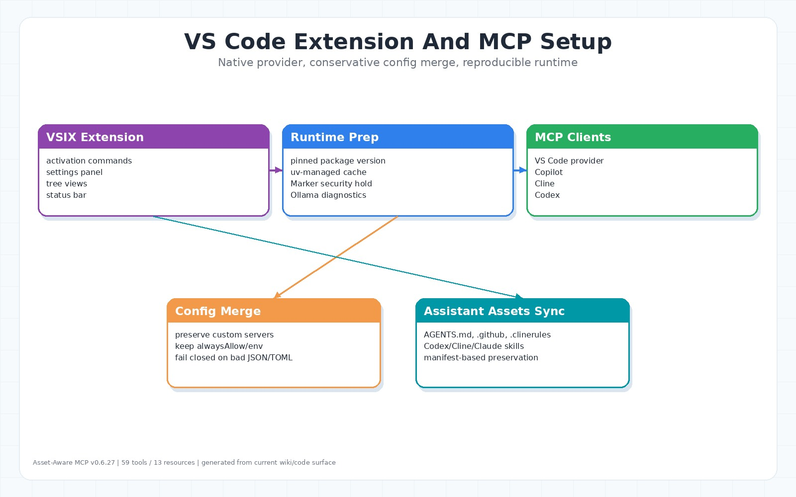

# VS Code Extension And MCP Setup



## Extension 責任

VS Code extension 位於 `vscode-extension/src`。它負責讓使用者不用手動組 MCP config，也能從 VS Code、Copilot、Cline、Codex 啟動同一個 Asset-Aware MCP server。

主要來源：

- `vscode-extension/src/extension.ts`
- `vscode-extension/src/mcpProvider.ts`
- `vscode-extension/src/copilotMcpConfig.ts`
- `vscode-extension/src/clineMcpConfig.ts`
- `vscode-extension/src/codexMcpConfig.ts`
- `vscode-extension/src/assistantAssets.ts`
- `vscode-extension/src/uv.ts`
- `vscode-extension/src/ollama.ts`

## MCP Config Merge

Extension 會保守 merge：

| 目標 | 行為 |
|---|---|
| Copilot | workspace `.vscode/mcp.json` |
| Cline | `cline_mcp_settings.json` |
| Codex | `~/.codex/config.toml` |

Merge 原則：

- 保留使用者自訂 server。
- 保留 Cline `alwaysAllow`、`disabled`、custom env 與 unrelated entries。
- malformed JSON/TOML 會 fail closed，必要時先備份。
- 不用空白 config 覆蓋現有設定。

## Runtime Preparation

Extension 啟動 server 時會使用 pinned package version，並透過 `uv` / `uvx` 準備 runtime。MCP launch env 預設把 `DATA_DIR` 放在 workspace `./data`，並把 `UV_CACHE_DIR` 放在 `DATA_DIR/.uv-cache`。Prepare Server Runtime 會使用 workspace root 的 `.uv-cache` 預熱 runtime；沒有 workspace 時才 fallback 到 extension global storage，避免依賴使用者全域 uv cache。

Marker backend setting 保留，但 security hold 期間不會安裝 `marker-pdf`。

## Assistant Assets Sync

VSIX 會打包 `vscode-extension/resources/repo-assets/asset-aware/**`。Extension 安裝/啟動時只會同步 assistant harness 類檔案到 workspace：

- `AGENTS.md`
- `.github/copilot-instructions.md`
- `.github/agents/**`
- `.github/bylaws/**`
- `.claude/skills/**`
- `.cline/skills/**`
- `.codex/skills/**`
- `.clinerules/**`

同步使用 `.asset-aware-mcp/assistant-assets.json` manifest。只有「先前由 extension 寫入且未被使用者修改」的檔案會自動更新；同路徑自訂檔會 preserved。

`scripts/count_tools.ps1` 等 package guard 相關檔案也會被打包在 repo-assets 中，用於 VSIX/package 檢查，但不是 `installAssistantAssets` 會寫回 workspace 的 assistant harness 目標。

## UI Components

| 檔案 | 用途 |
|---|---|
| `documentTreeProvider.ts` | 文件樹 |
| `tableTreeProvider.ts` | A2T table tree |
| `statusTreeProvider.ts` | 狀態與 runtime tree |
| `statusBar.ts` | 狀態列 |
| `settingsPanel.ts` | 設定面板 |
| `dfm/*` | DFM editor service 與 language features |

## Extension Checks

```bash
cd vscode-extension
npm run test:ci
npm run sync-assets:check
npm run test:install-smoke
```

Package contents tests 會防止 dev-only extension 檔與 generated dirs 混入 repo-assets，例如 `repo-assets/**/dist`、`repo-assets/**/.venv`、`repo-assets/**/.pytest_cache`、`repo-assets/**/__pycache__`、nested generated repo-assets、`node_modules` 等。Root-level `vscode-extension/.venv` 不屬於 assistant asset sync 目標；若要檢查，需用 release artifact audit 或額外 package rule。
